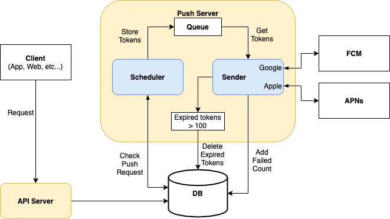

# .Net Core로 푸시 서버 개발

IIS 웹서버에서 동작하는 푸시 서버로 스케쥴러 1개와 다수의 푸시 센더 쓰레드로 구성되어 있다.   
스케쥴러에서 주기적으로 푸시 발송 요청 사항이 등록된 게 있는지 체크하고,   
요청 사항이 있는 경우 발송할 목적 토큰들을 토큰 큐에 정해진 수량만큼 저장한다.
센더에서는 큐에 담긴 토큰 정보를 가져와서 FCM이나 APNs에 발송하고 응답 결과가 200이 아닌 경우
토큰을 만료 처리하고 실패 횟수를 증가시킨다.

## #. 구조

